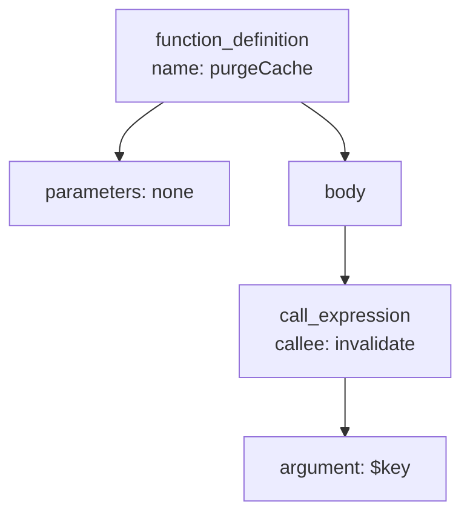
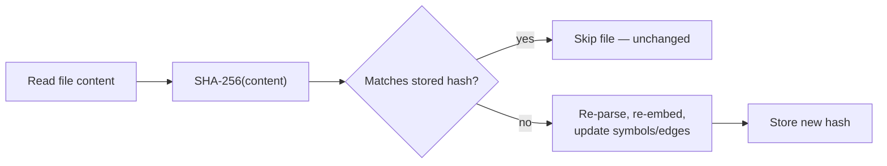
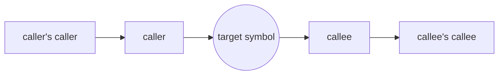
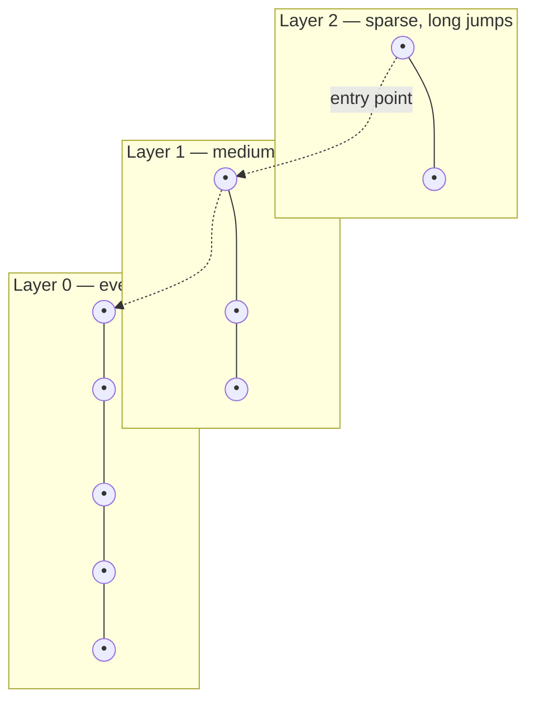

# code-context-mcp

MCP server that scans and indexes an entire codebase — not just listing symbols, but building a **relationship graph** (calls, imports, inheritance, WordPress hooks) plus **vector embeddings** in PostgreSQL/pgvector — so AI agents get comprehensive project context.

## Architecture

```
┌─────────────┐   tree-sitter    ┌──────────────────────────────┐
│ Project dir │ ───────────────▶ │ symbols (fn/class/method)    │
│ (.php .js   │   AST walk       │ edges   (CALLS/IMPORTS/      │
│  .ts .tsx)  │                  │          EXTENDS/HOOKS…)     │
└─────────────┘                  │ embeddings (pgvector, HNSW)  │
                                 └───────────────┬──────────────┘
                                                 │ SQL + ANN
                                 ┌───────────────▼──────────────┐
                                 │ MCP tools over stdio          │
                                 │ search_code · get_graph ·     │
                                 │ get_callers · overview …      │
                                 └──────────────────────────────┘
```

- **Languages:** PHP, JavaScript, TypeScript, JSX/TSX (extendable in `src/parser.js`)
- **Graph relations:** `CALLS`, `INSTANTIATES`, `IMPORTS`, `EXTENDS`, `IMPLEMENTS`, `REGISTERS_HOOK`, `FIRES_HOOK` (WordPress `add_action`/`do_action`/`apply_filters` aware)
- **Incremental indexing:** SHA-256 per file; unchanged files are skipped, deleted files are pruned
- **Embeddings:** Voyage (`voyage-code-3`, recommended for code) or OpenAI, or `none` (graph + keyword search still work)

New to terms like AST, BFS, HNSW, cosine distance, or RRF? See [Algorithms & concepts explained](#algorithms--concepts-explained) below.

## Algorithms & concepts explained

The terms above (and elsewhere in this README) explained for anyone who hasn't worked with them before.

### AST parsing (tree-sitter)

An **AST** (Abstract Syntax Tree) is a tree-shaped representation of source code — each node is a language construct (a function, a call, an argument), not just raw text. `src/parser.js` has tree-sitter parse each file into this tree, then walks every node to pull out symbols (`function_definition`, `class_declaration`, …) and relationships (`call_expression`, `class_heritage`, …).

```php
function purgeCache() {
    invalidate($key);
}
```



The indexer turns the `function_definition` node into a `symbols` row, and the `call_expression` node into a `CALLS` edge from `purgeCache` to `invalidate`.

### Incremental hashing (SHA-256)

Re-parsing every file on every run would be slow, so each file's content is hashed with **SHA-256** (a one-way fingerprint where any content change — even one character — produces a completely different hash) and compared against the hash stored from the last run.



### BFS graph traversal (`get_graph`)

`get_graph` explores the `edges` table with a **breadth-first search (BFS)**: from the starting symbol it visits every direct neighbor first (depth 1, both callers and callees), then every neighbor-of-a-neighbor (depth 2), and so on up to the requested `depth`. This differs from a depth-first search, which would follow one chain as far as possible before backtracking — BFS instead guarantees everything within N hops is found before anything further away.



Each ring above is one BFS layer — `depth=1` returns just the inner ring, `depth=2` adds the outer ring, and so on (capped at 60 nodes total, so a very hub-like symbol doesn't pull in the whole codebase).

### Vector embeddings & cosine distance

An **embedding** is a list of ~1000 numbers (a vector) representing what a piece of code *means*, produced by an embedding model (Voyage/OpenAI). Two symbols that do similar things end up with vectors pointing in a similar direction — measured as **cosine distance**: how large the angle between two vectors is, ignoring their length.

```
      rotateSecretKey
             ↗
            ╱   θ  (small angle → similar meaning)
           ╱________________→ revokeSigningKey
                                    ⟍
                                     ⟍  (large angle → unrelated)
                                      ↘
                              unrelated function
```

Small angle (θ ≈ 0°) → cosine distance ≈ 0 → very similar meaning, even with completely different names or wording. Large angle (θ ≈ 90°+) → cosine distance ≈ 1+ → unrelated. `search_code`'s vector half and all of `find_related` rank symbols by this distance (Postgres's `<=>` operator, using pgvector's `vector_cosine_ops`).

### HNSW — the approximate nearest-neighbor index

Comparing a query's embedding against every single stored embedding one by one would be too slow at scale. Postgres instead uses an **HNSW** (Hierarchical Navigable Small World) index: a multi-layer graph where the top layer has a few nodes with long "highway" connections, and each layer below is denser, until the bottom layer connects every vector to its close neighbors.



A search starts at the top layer's entry point, greedily hops to whichever neighbor is closest to the query, and drops down a layer whenever no closer neighbor exists at the current one — arriving at a very good (not always perfect, hence "approximate") set of nearest neighbors in roughly log-time instead of scanning every row.

### Weighted full-text search (`tsvector`)

Postgres full-text search doesn't just check whether a word appears — `symbols.fts_vector` is built with `setweight()` so a match in the symbol's `name` (weight `A`) counts for more than a match in its `doc` comment (weight `B`), which counts for more than a match somewhere in the `body` (weight `C`). `ts_rank()` uses these weights, so a query like `"purge cache"` ranks a function literally named `purgeCache` above one that merely mentions "purge" once in a comment.

### Reciprocal Rank Fusion (RRF)

`search_code` gets two independently-ranked lists — full-text matches and vector/semantic matches — and needs to merge them into one ranking without either signal's raw scores (which aren't on comparable scales) dominating the other. **RRF** solves this using only each result's *position* in its list:

```
score(symbol) = Σ 1 / (k + rank_in_list)     (k = 60; summed over every list the symbol appears in)
```

| Symbol | Full-text rank | Vector rank | RRF score | Why |
|---|---|---|---|---|
| `purgeCacheAfterMatch` | 1 | 3 | 1/61 + 1/63 ≈ 0.0323 | found by both signals |
| `invalidateMatchCache` | — | 1 | 1/61 ≈ 0.0164 | vector-only, but ranked #1 there |
| `clearAllCaches` | 2 | — | 1/62 ≈ 0.0161 | full-text-only |

A symbol found by *both* searches — even at a middling rank in each — usually outranks one that only appears in a single list; that's the point of fusing two different signals instead of picking one. Each `search_code` result's `matched_via` field tells you which list(s) actually found it.

## Why an embedding provider?

Semantic search — the vector-ANN half of `search_code` and all of `find_related` — needs a numeric embedding for every indexed symbol. This server doesn't run a local embedding model, so it calls an external API to generate those vectors at index time (and for each query). `VOYAGE_API_KEY` / `OPENAI_API_KEY` in `.env` are what that call authenticates with:

- **Voyage AI** (`voyage-code-3`) — the recommended default. It's trained specifically on code, so it tends to place semantically similar functions closer together than a general-purpose text embedding model would.
- **OpenAI** (`text-embedding-3-small`) — a general-purpose alternative, useful if you already have OpenAI API access and would rather not manage a second provider's key.
- **`EMBEDDING_PROVIDER=none`** — skip embeddings entirely. `index_project`, the graph tools (`get_graph`, `get_callers`, `get_callees`, `get_file_outline`, `project_overview`), and the full-text half of `search_code` all work with no API key. You only lose the semantic/ANN component of `search_code` (matches found by meaning, not just shared words) and `find_related` returns nothing.

Either provider is a fine choice — pick whichever fits your budget or existing infra. Just make sure `EMBEDDING_DIM` matches the model you pick (see comments in `.env.example`); changing it later requires re-running `init-db` and reindexing.

### Tracking token usage & cost

Every embedding API call (indexing documents, or embedding a `search_code` query) logs its `provider`, `model`, `input_type`, and the token count the API reported into the `embedding_usage` table — see [Database schema](#database-schema). View it with:

```bash
codecontext usage                 # all projects, grouped by provider/model/input_type
codecontext usage <project-name>  # scoped to one project
```

Estimated cost is only shown if you set `VOYAGE_PRICE_PER_1M_TOKENS` / `OPENAI_PRICE_PER_1M_TOKENS` (USD per 1M tokens) in `.env` — this isn't hardcoded in the source since provider pricing changes over time; check the provider's current pricing page and set the rate yourself. Without it, `usage` still shows exact token counts, just no `est_cost_usd` column value.

Reference pricing, fetched directly from each provider's own docs on 2026-07-21 (verify against the live pages below before relying on this for budgeting — rates change):

| Provider | Model | Price (USD / 1M tokens) | Source |
|---|---|---|---|
| Voyage AI | `voyage-code-3` (this project's default) | $0.18 | [docs.voyageai.com/docs/pricing](https://docs.voyageai.com/docs/pricing) |
| Voyage AI | `voyage-4` | $0.06 | [docs.voyageai.com/docs/pricing](https://docs.voyageai.com/docs/pricing) |
| Voyage AI | `voyage-4-large` | $0.12 | [docs.voyageai.com/docs/pricing](https://docs.voyageai.com/docs/pricing) |
| Voyage AI | `voyage-4-lite` | $0.02 | [docs.voyageai.com/docs/pricing](https://docs.voyageai.com/docs/pricing) |
| OpenAI | `text-embedding-3-small` (this project's default) | $0.02 standard / $0.01 batch | [developers.openai.com/api/docs/models/text-embedding-3-small](https://developers.openai.com/api/docs/models/text-embedding-3-small) |

`VOYAGE_PRICE_PER_1M_TOKENS=0.18` and `OPENAI_PRICE_PER_1M_TOKENS=0.02` (the standard, non-batch rate) are already set in `.env` to match this project's configured models (`VOYAGE_MODEL`/`OPENAI_EMBEDDING_MODEL`) — update them if you switch models or a provider changes pricing.

Usage tracking only covers calls made after upgrading to this version — run `codecontext init-db` once to create the `embedding_usage` table if it doesn't exist yet.

## Setup on Ubuntu

### 1. PostgreSQL + pgvector

```bash
sudo apt update
sudo apt install -y postgresql postgresql-contrib postgresql-16-pgvector
# On older Ubuntu, build pgvector from source:
#   sudo apt install -y postgresql-server-dev-16 build-essential git
#   git clone https://github.com/pgvector/pgvector && cd pgvector && make && sudo make install

sudo -u postgres psql -c "CREATE USER codectx WITH PASSWORD 'codectx';"
sudo -u postgres psql -c "CREATE DATABASE codectx OWNER codectx;"
sudo -u postgres psql -d codectx -c "CREATE EXTENSION vector;"
```

If you run Postgres in Docker instead, use the `pgvector/pgvector:pg16` image.

### 2. Install & init

```bash
# tree-sitter grammars compile native bindings:
sudo apt install -y build-essential python3

cd code-context-mcp
npm install
cp .env.example .env    # fill in DATABASE_URL + embedding API key
npm run init-db
```

### 3. CLI

Every MCP tool is also available as a CLI subcommand via `src/cli.js` — useful for a first index, or for querying the graph/search tools from a terminal without going through an MCP client.

```bash
node src/cli.js index_project <project-name> /path/to/project/
node src/cli.js stats
```

To call it as a plain `codecontext` command from anywhere, link the package once:

```bash
cd code-context-mcp
npm link
```

```bash
codecontext help
codecontext index_project <project-name> /path/to/project/
codecontext search_code <project-name> "purge cache after match update"
codecontext get_symbol <project-name> <name>
codecontext get_callers <project-name> <name>
codecontext get_graph <project-name> <name> [depth]
codecontext project_overview <project-name>
codecontext tables                        # list tables + approx row counts
codecontext tables symbols 50             # browse rows of one table (default limit 20)
codecontext db                             # interactive psql session against DATABASE_URL
codecontext usage                          # embedding token usage, all projects
codecontext usage <project-name>           # embedding token usage, one project
```

`index` is kept as an alias for `index_project`, and `stats` prints `list_projects` as a table instead of JSON. `db` requires the `psql` client (`sudo apt install -y postgresql-client` if missing).

Every DB/network-backed subcommand shows a spinner with a live elapsed-time counter (e.g. `⠹ Searching "purge cache"… 0.8s`) while it runs, then a final `✔ label (Xs)` line — so a slow embedding-API call or a big-table scan doesn't look hung. It only starts animating after ~150ms (fast queries just print the final line, no flicker), and it's written to **stderr**, so stdout stays clean JSON for piping (`codecontext search_code proj query 2>/dev/null | jq`). In a non-TTY context (CI, redirected output) it skips the animation and prints just the final line. `index_project` is the one exception — it already streams its own per-step progress via `console.log`, so a spinner would just fight it.

### 4. Register with Claude Code

```bash
claude mcp add code-context -- node /absolute/path/to/code-context-mcp/src/server.js
```

Or in `.mcp.json` (project scope):

```json
{
  "mcpServers": {
    "code-context": {
      "command": "node",
      "args": ["/absolute/path/to/code-context-mcp/src/server.js"]
    }
  }
}
```

(Registration options: https://docs.claude.com/en/docs/claude-code/mcp)

## MCP tools

| Tool | Purpose |
|---|---|
| `index_project` | Scan + (re)index a directory. Incremental. |
| `list_projects` | Indexed projects with counts. |
| `project_overview` | Languages, dir sizes, hub symbols, WP hooks — the "big picture" call. |
| `search_code` | Hybrid search (full-text + semantic ANN, RRF-fused): "purge cache after cron match update" → relevant functions. |
| `get_symbol` | Full detail of a function/class/method (accepts `Class::method`). |
| `get_callers` | Inbound edges — blast radius before refactoring. |
| `get_callees` | Outbound dependencies incl. hooks registered/fired. |
| `get_graph` | BFS subgraph around a symbol (depth 1–4) — feature wiring map. |
| `get_file_outline` | All symbols in one file. |
| `find_related` | Semantically similar symbols — discover a feature's full surface. |

## Database schema

Everything is stored in 4 Postgres tables, one project's worth of code broken down into files → symbols → edges. Browse them directly with `codecontext tables` / `codecontext db` (see [CLI](#3-cli)).

```
projects ──< files ──< symbols ──< edges >── symbols
   (1)        (N)         (N)        (N)        (also N, self-referencing)
```

### `projects`

One row per indexed codebase (what you pass as `<project>` to every tool/CLI command).

| Column | Type | Meaning |
|---|---|---|
| `id` | `serial` (PK) | Internal numeric ID; other tables reference this, not the name. |
| `name` | `text` (unique) | The short project name you chose, e.g. `dating-local`. |
| `root_path` | `text` | Absolute path on disk that was indexed. Re-indexing the same `name` updates this if the path moved. |
| `indexed_at` | `timestamptz` | Timestamp of the last completed `index_project` run. |

### `files`

One row per source file that was scanned (after `.gitignore`/`node_modules`/etc. filtering).

| Column | Type | Meaning |
|---|---|---|
| `id` | `serial` (PK) | Internal ID; `symbols.file_id` points here. |
| `project_id` | `int` (FK → `projects.id`) | Which project this file belongs to. Deleting a project cascades and removes its files. |
| `path` | `text` | File path relative to `root_path` (not absolute), e.g. `inc/tracking/clickid.php`. Unique per project. |
| `language` | `text` | Detected language (`php`, `javascript`, `typescript`, `tsx`, …) from the file extension. |
| `hash` | `text` | SHA-256 of the file's content. Compared on the next `index_project` run to skip unchanged files — this is what makes indexing incremental. |
| `loc` | `int` | Line count. |
| `updated_at` | `timestamptz` | When this file row was last (re)written by the indexer. |

### `symbols`

One row per function, method, class, interface, or trait found inside a file — the unit everything else (search, graph, callers) is built on.

| Column | Type | Meaning |
|---|---|---|
| `id` | `serial` (PK) | Internal ID; referenced by `edges.src` / `edges.dst`. |
| `project_id` | `int` (FK → `projects.id`) | Which project this symbol belongs to. |
| `file_id` | `int` (FK → `files.id`) | Which file defines this symbol. |
| `name` | `text` | Symbol name. Methods are stored as `ClassName::methodName` so they stay unique and greppable across a whole class hierarchy. |
| `kind` | `text` | One of `function`, `method`, `class`, `interface`, `trait`. |
| `signature` | `text` | The declaration line (parameters, return type where the language has one). |
| `doc` | `text` | The docblock/leading comment directly above the symbol, if any. |
| `start_line` / `end_line` | `int` | Where the symbol's body starts/ends in the file — what `get_symbol` uses to show source, and what an editor jump-to-definition would use. |
| `body` | `text` | The symbol's source code, truncated to 6 KB (see [Notes & limits](#notes--limits)). |
| `embedding` | `vector(EMBEDDING_DIM)` | The symbol's semantic embedding (from Voyage/OpenAI), used by the vector half of `search_code` and by `find_related`. `NULL` when `EMBEDDING_PROVIDER=none`. |
| `fts_vector` | `tsvector` (generated) | Auto-computed full-text index over `name` (weight A) + `doc` (weight B) + `body` (weight C) — the full-text half of `search_code`. You never write this column directly; Postgres regenerates it whenever the row changes. |

Indexed on `(project_id, name)` for exact/fuzzy symbol lookups, on `file_id` for `get_file_outline`, on `embedding` (HNSW) for ANN search, and on `fts_vector` (GIN) for full-text search.

### `edges`

One row per relationship between two symbols (or a symbol and something unresolved) — this is the "relationship graph" the project description refers to. `get_graph`/`get_callers`/`get_callees` are just BFS/lookup queries over this table.

| Column | Type | Meaning |
|---|---|---|
| `id` | `serial` (PK) | Internal ID. |
| `project_id` | `int` (FK → `projects.id`) | Which project this edge belongs to. |
| `src` | `int` (FK → `symbols.id`) | The symbol where the reference originates (the caller, the subclass, the file registering a hook). |
| `dst` | `int` (FK → `symbols.id`, nullable) | The symbol being referenced, if it was resolved to a known symbol in the same project. |
| `dst_name` | `text` (nullable) | The raw callee/import/hook name as written in the source, used when `dst` couldn't be resolved (e.g. a dynamic call like `call_user_func($fn)`, or a symbol defined outside the indexed project). Still useful signal even unresolved. |
| `relation` | `text` | The kind of relationship — one of `CALLS`, `INSTANTIATES`, `EXTENDS`, `IMPLEMENTS`, `IMPORTS`, `REGISTERS_HOOK` (WordPress `add_action`/`add_filter`), `FIRES_HOOK` (WordPress `do_action`/`apply_filters`). |
| `file_id` | `int` (FK → `files.id`) | Which file the reference was found in (usually the same file as `src`, but not always, e.g. for cross-file hook registration). |
| `line` | `int` | Line number of the reference. |

Indexed on `src` and `dst` (traversal in either direction) and on `(project_id, relation)` (filtering by relationship type).

### `embedding_usage`

One row per embedding API call (indexing a batch of symbols, or embedding a `search_code` query) — powers `codecontext usage`. See [Tracking token usage & cost](#tracking-token-usage--cost).

| Column | Type | Meaning |
|---|---|---|
| `id` | `serial` (PK) | Internal ID. |
| `project_id` | `int` (FK → `projects.id`, nullable) | Which project triggered this call. `SET NULL` (not `CASCADE`) on project deletion — billing history survives a project being dropped. |
| `provider` | `text` | `voyage` or `openai`. |
| `model` | `text` | The embedding model used, e.g. `voyage-code-3`. |
| `input_type` | `text` | `document` (indexing) or `query` (a `search_code` call). |
| `tokens` | `int` | Token count the provider's API reported for this call (its `usage.total_tokens`). |
| `created_at` | `timestamptz` | When the call happened. |

Indexed on `project_id` and on `(provider, model)`.

## How `search_code` works

`search_code` is a hybrid search: it always runs a Postgres full-text query, and — when an embedding provider is configured — also runs a pgvector nearest-neighbor query, then merges the two ranked lists with Reciprocal Rank Fusion (RRF). (New to any of these terms? See [Algorithms & concepts explained](#algorithms--concepts-explained).)

1. **Full-text candidates** — every indexed symbol has a generated `fts_vector` column (`name` weighted highest, then `doc`, then `body`), so a query like `"purge cache after match update"` matches on literal words. This always runs, with no API key required.
2. **Vector candidates** (only if `EMBEDDING_PROVIDER` isn't `none`) — the query is embedded and compared against each symbol's stored embedding by cosine distance, surfacing matches by *meaning* even when the wording differs from the code (e.g. a query about "revoking a signing key" finding a function named `rotateSecretKey`).
3. **Fusion** — both ranked lists are combined via RRF: a symbol ranked highly in *both* lists outranks one that only appears in a single list. Each result includes a `score` (the fused RRF score, not a raw similarity) and `matched_via` (`["fts"]`, `["vector"]`, or `["fts","vector"]`) showing which signal(s) found it.

With `EMBEDDING_PROVIDER=none`, step 2 is skipped and results are full-text only — still better than a plain substring search, just without the semantic/meaning-based matches.

One current limitation: Postgres's full-text tokenizer splits on punctuation/whitespace, not on camelCase or snake_case boundaries, so `purgeCacheAfterMatchUpdate` is indexed as a single token rather than four separate words. Multi-word queries still find such symbols via the vector half (when embeddings are enabled) or by matching the `doc`/`body` text, just not by decomposing the identifier itself.

## Suggested agent workflow (e.g. in CLAUDE.md)

```
Before modifying code:
1. project_overview → orient
2. search_code with the task description → candidate symbols
3. get_graph / get_callers on the target → impact analysis
4. get_symbol → read actual source
Re-run index_project after committing changes.
```

## Extending

- **More languages:** add a tree-sitter grammar package, map extensions in `EXT_LANG`, add node types in `parser.js`.
- **File watcher:** wrap `indexProject` with `chokidar` for auto reindex on save.
- **Feature clustering:** k-means over the embedding column (`symbols.embedding`) to auto-name feature groups.

## Notes & limits

- Call resolution is name-based (exact + `Class::method` suffix), not type-inferred — dynamic calls (`$fn()`, `call_user_func`) stay as unresolved `dst_name` edges, which is still useful signal.
- Symbol bodies are truncated at 6 KB for storage/embedding.
- Files > 1 MB skipped (configurable via `MAX_FILE_SIZE`).

## Changes

### 2026-07-21
- Added a reference pricing table (fetched from Voyage's and OpenAI's own docs) to "Tracking token usage & cost", and set `VOYAGE_PRICE_PER_1M_TOKENS`/`OPENAI_PRICE_PER_1M_TOKENS` in `.env` to match.
- Added an "Algorithms & concepts explained" section: plain-language explanations (with Mermaid/ASCII diagrams) of AST parsing, SHA-256 incremental hashing, BFS graph traversal, vector embeddings/cosine distance, HNSW, weighted full-text search, and Reciprocal Rank Fusion — cross-linked from where each term first appears.
- Added `codecontext usage [project]`: every embedding API call now logs its provider/model/input_type and reported token count to a new `embedding_usage` table, viewable as an aggregate report with an estimated cost column when `VOYAGE_PRICE_PER_1M_TOKENS`/`OPENAI_PRICE_PER_1M_TOKENS` is set in `.env`.
- Fixed the CLI spinner showing `✔` (success) even when the wrapped command threw; it now shows `✖` on failure.
- Added a spinner + live elapsed-time indicator to every DB/network-backed `codecontext` subcommand (e.g. `⠹ Searching "..."… 0.8s` → `✔ Searching "..." (1.2s)`), written to stderr so stdout JSON stays pipeable; falls back to a single plain line in non-TTY contexts. `index_project` keeps its own step-by-step log output instead.
- Added a `codecontext` CLI: `src/cli.js` now exposes every MCP tool (`search_code`, `get_symbol`, `get_callers`, `get_callees`, `get_graph`, `get_file_outline`, `find_related`, `project_overview`, `list_projects`) as a subcommand, in addition to the existing `index`/`stats`/`init-db`. Registered as a `bin` entry in `package.json`; run `npm link` to get a global `codecontext` command.
- Added `codecontext db` (interactive `psql` session against `DATABASE_URL`) and `codecontext tables [table] [limit]` (list tables with row counts, or browse a table's rows) for inspecting the Postgres schema directly from the terminal.
- Added a "Database schema" section documenting all 4 tables (`projects`, `files`, `symbols`, `edges`), every column's meaning, and how they relate, so the Postgres structure is understandable without reading `src/db.js`.

### 2026-07-18
- Fixed `Parse failed: ... (Invalid argument)` errors on larger source files: `parseFile` now passes an explicit `bufferSize` to tree-sitter's `parse()`, avoiding a chunked-read bug in the native binding that triggered once file content reached 32768 UTF-16 units.
- Added hybrid search (full-text + pgvector ANN, RRF-fused) to `search_code`.
- Documented why an embedding provider (Voyage/OpenAI) is needed and added a "How `search_code` works" section explaining the full-text/vector/RRF fusion.
