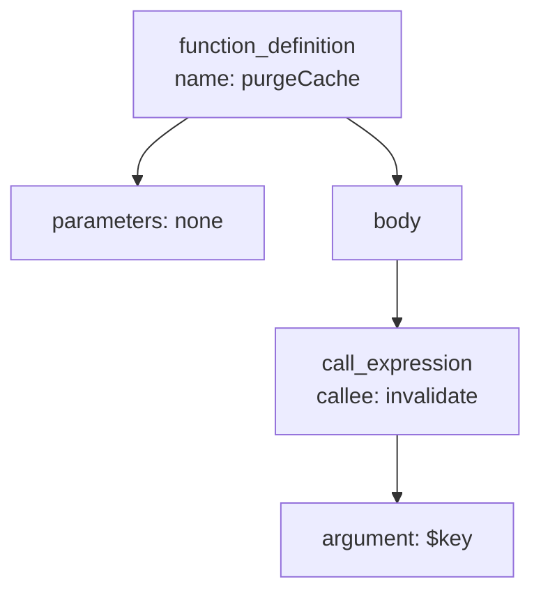
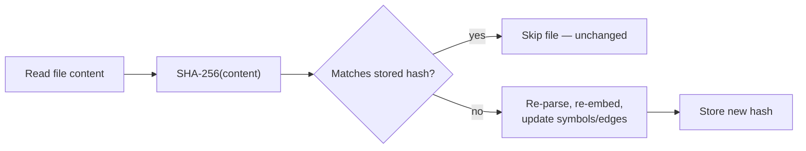
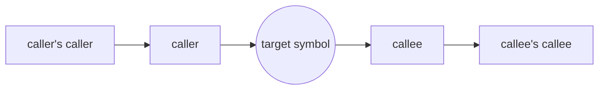

# Algorithms & concepts explained


The terms used throughout the rest of the documentation, explained for anyone who hasn't worked with them before.

## AST parsing (tree-sitter)

An **AST** (Abstract Syntax Tree) is a tree-shaped representation of source code — each node is a language construct (a function, a call, an argument), not just raw text. `src/parser.js` has tree-sitter parse each file into this tree, then walks every node to pull out symbols (`function_definition`, `class_declaration`, …) and relationships (`call_expression`, `class_heritage`, …).

```php
function purgeCache() {
    invalidate($key);
}
```



The indexer turns the `function_definition` node into a `symbols` row, and the `call_expression` node into a `CALLS` edge from `purgeCache` to `invalidate`.

## Incremental hashing (SHA-256)

Re-parsing every file on every run would be slow, so each file's content is hashed with **SHA-256** (a one-way fingerprint where any content change — even one character — produces a completely different hash) and compared against the hash stored from the last run.



## BFS graph traversal (`get_graph`)

`get_graph` explores the `edges` table with a **breadth-first search (BFS)**: from the starting symbol it visits every direct neighbor first (depth 1, both callers and callees), then every neighbor-of-a-neighbor (depth 2), and so on up to the requested `depth`. This differs from a depth-first search, which would follow one chain as far as possible before backtracking — BFS instead guarantees everything within N hops is found before anything further away.



Each ring above is one BFS layer — `depth=1` returns just the inner ring, `depth=2` adds the outer ring, and so on (capped at 60 nodes total, so a very hub-like symbol doesn't pull in the whole codebase).

## Vector embeddings & cosine distance

An **embedding** is a list of ~1000 numbers (a vector) representing what a piece of code *means*, produced by an embedding model (Voyage/OpenAI). Two symbols that do similar things end up with vectors pointing in a similar direction — measured as **cosine distance**: how large the angle between two vectors is, ignoring their length.


Small angle (θ ≈ 0°) → cosine distance ≈ 0 → very similar meaning, even with completely different names or wording. Large angle (θ ≈ 90°+) → cosine distance ≈ 1+ → unrelated. `search_code`'s vector half and all of `find_related` rank symbols by this distance (Postgres's `<=>` operator, using pgvector's `vector_cosine_ops`).

## HNSW — the approximate nearest-neighbor index

Comparing a query's embedding against every single stored embedding one by one would be too slow at scale. Postgres instead uses an **HNSW** (Hierarchical Navigable Small World) index: a multi-layer graph where the top layer has a few nodes with long "highway" connections, and each layer below is denser, until the bottom layer connects every vector to its close neighbors.


A search starts at the top layer's entry point, greedily hops to whichever neighbor is closest to the query, and drops down a layer whenever no closer neighbor exists at the current one — arriving at a very good (not always perfect, hence "approximate") set of nearest neighbors in roughly log-time instead of scanning every row.

## Weighted full-text search (`tsvector`)

Postgres full-text search doesn't just check whether a word appears — `symbols.fts_vector` is built with `setweight()` so a match in the symbol's `name` (weight `A`) counts for more than a match in its `doc` comment (weight `B`), which counts for more than a match somewhere in the `body` (weight `C`). `ts_rank()` uses these weights, so a query like `"purge cache"` ranks a function literally named `purgeCache` above one that merely mentions "purge" once in a comment.

## Reciprocal Rank Fusion (RRF)

`search_code` gets two independently-ranked lists — full-text matches and vector/semantic matches — and needs to merge them into one ranking without either signal's raw scores (which aren't on comparable scales) dominating the other. **RRF** solves this using only each result's *position* in its list:

```
score(symbol) = Σ 1 / (k + rank_in_list)     (k = 60; summed over every list the symbol appears in)
```

| Symbol | Full-text rank | Vector rank | RRF score | Why |
|---|---|---|---|---|
| `purgeCacheAfterMatch` | 1 | 3 | 1/61 + 1/63 ≈ 0.0323 | found by both signals |
| `invalidateMatchCache` | — | 1 | 1/61 ≈ 0.0164 | vector-only, but ranked #1 there |
| `clearAllCaches` | 2 | — | 1/62 ≈ 0.0161 | full-text-only |

A symbol found by *both* searches — even at a middling rank in each — usually outranks one that only appears in a single list; that's the point of fusing two different signals instead of picking one. Each `search_code` result's `matched_via` field tells you which list(s) actually found it.

## How `search_code` works

`search_code` is a hybrid search: it always runs a Postgres full-text query, and — when an embedding provider is configured — also runs a pgvector nearest-neighbor query, then merges the two ranked lists with Reciprocal Rank Fusion (RRF). (New to any of these terms? See the sections above.)

1. **Full-text candidates** — every indexed symbol has a generated `fts_vector` column (`name` weighted highest, then `doc`, then `body`), so a query like `"purge cache after match update"` matches on literal words. This always runs, with no API key required.
2. **Vector candidates** (only if `EMBEDDING_PROVIDER` isn't `none`) — the query is embedded and compared against each symbol's stored embedding by cosine distance, surfacing matches by *meaning* even when the wording differs from the code (e.g. a query about "revoking a signing key" finding a function named `rotateSecretKey`).
3. **Fusion** — both ranked lists are combined via RRF: a symbol ranked highly in *both* lists outranks one that only appears in a single list. Each result includes a `score` (the fused RRF score, not a raw similarity) and `matched_via` (`["fts"]`, `["vector"]`, or `["fts","vector"]`) showing which signal(s) found it.

With `EMBEDDING_PROVIDER=none`, step 2 is skipped and results are full-text only — still better than a plain substring search, just without the semantic/meaning-based matches.

One current limitation: Postgres's full-text tokenizer splits on punctuation/whitespace, not on camelCase or snake_case boundaries, so `purgeCacheAfterMatchUpdate` is indexed as a single token rather than four separate words. Multi-word queries still find such symbols via the vector half (when embeddings are enabled) or by matching the `doc`/`body` text, just not by decomposing the identifier itself.

